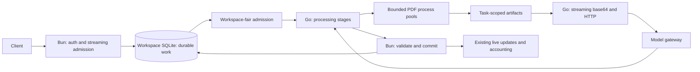

# Go document processor

The Go service executes smart template selection, smart splitting, PDF preparation,
model transport and extraction. Bun retains authentication, the public API, the
Workspace-fair admission queue, durable product storage and validation. Frontend and public API behavior are preserved. Physical Sources and logical PDF page views expose the correct document pages. Go is the sole background processing engine.

## Run

Source development requires Go matching `go.mod` and the repository's pinned Bun runtime.
Release archives bundle processors for Linux/macOS on x64/ARM64; installation selects
the matching binary without requiring a Go compiler.

```sh
bun run build
bun run start
```

Go is the sole background document processor. Startup fails clearly if the binary
is missing; there is no runtime switch or Bun fallback. `GO_PROCESSOR_BINARY` may
point to a separately built binary, otherwise startup uses
`backend-go/bin/document-extraction`. The Bun supervisor starts a private loopback
service with a random capability token and restarts it after process loss.

```sh
bun run test
bun run test:go
bun run benchmark:loopback-saturation
```

The benchmark uses the same simulated gateway, fixture generator, HTTP uploads,
real PDF operations, persisted completion timestamps and expected stage counts as
the historical Bun benchmark. Set `LOOPBACK_BENCH_*` controls as described in `backend/README.md`.
The reported process tree includes Bun, Go and all PDF workers.
See [the original comparison](BENCHMARKS.md), the
[provider-wait and PNG-encoding follow-up](STAGE-BENCHMARKS.md), and the
[logical-source and shared-page benchmarks](SOURCE-VIEW-BENCHMARKS.md), and the
[rendering overlap and Go data-handoff evaluation](OPTIMIZATION-BENCHMARKS.md).

## Execution architecture



* Separate pools handle PDF materialization and rendering. Rendering uses the
  existing PDF.js/canvas rasterizer and dimensions, with faster lossless PNG
  encoding that preserves decoded pixels. Selected pages render directly without
  creating a subset PDF. The original encoder remains a payload-limit fallback.
  Rendering overlaps one page’s encoding with the next page’s rasterization, with at most two outstanding pages. Keeping renderer processes warm amortizes module startup. They recycle after
  128 operations, 64 MiB of source input or 384 MiB sampled RSS. Preparation workers
  retain the existing 128 MiB recycling threshold. Idle workers exit after five
  seconds. Materialization has a cancellable 20-second deadline. Rendering remains
  cancellable for the whole Document, including PDFs with many pages.
* PDF admission alternates two continuation/child turns with one new-parent turn,
  preserving FIFO within each class. Artifact space is reserved when work enters
  the pool, not while it waits behind other PDFs.
* Local split children own durable page views over hard-linked immutable originals.
  No child PDF is created until a native-PDF model or a Source download needs it.
  Packet cleanup cannot invalidate a child's source. S3-retained children retain
  eager derived-PDF publication and existing independent remote retention.
* Prepared files are reused across automatic selection and extraction. A bounded
  Workspace/source/page cache also shares exact parent PNGs with its children.
  Independent submissions never share by content hash. Readers own private links;
  eviction cannot invalidate an upload. Child completion removes shared entries,
  and abandoned entries expire after one idle minute (five-second sweeps).
* File-backed admission inspection and Go PDF workers read private source paths
  directly, avoiding whole-PDF copies through the public Bun heap and IPC pipes.
  Parser bounds, deadlines and isolation remain. Opaque grayscale pages use exact
  8-bit grayscale PNG; colored/transparent pages retain RGBA.
* Go reads artifacts through a bounded buffer and streams base64 into the request.
  It supplies an exact Content-Length and does not allocate a complete encoded
  document or serialized model request. Network concurrency is independent of PDF
  worker count. Workspace sequential-call settings still cover preparation and
  transport. Final extraction releases prepared files and artifact credits as soon
  as request upload completes; durable sources stay until result commit.
* Concurrent upload acceptance and processing mutations can share one SQLite
  FULL-synchronous commit.
  Batches flush at 64 operations or four milliseconds. Successful model usage and
  validated results share one adapter call and commit. Invalid results still record
  usage before the existing retry policy. Each operation has a savepoint. No operation is acknowledged before the outer
  commit. An invalid operation rolls back independently.
* Accounting callbacks transfer only usage metadata, not a second copy of the
  extracted content. Bun owns extraction result normalization and durable result insertion.
* The existing authoritative store owns fixed Template bindings, immutable split
  plans and child identities, retries, results, accounting, retention and review
  states. Go stages acquire durable claims before model calls. Restart recovery
  reads the same persisted records as the Bun runtime.
* The Go module uses only the standard library. PDF workers use the repository's
  pinned Bun dependencies. This preserves parsing and rendering behavior while
  changing scheduling, artifact lifetime and transport.

## Controls

| Variable | Default | Purpose |
| --- | --- | --- |
| `GO_PROCESSOR_BINARY` | `backend-go/bin/document-extraction` | Override the processor binary path. |
| `GO_MODEL_CONCURRENCY` | `EXTRACTION_MAX_CONCURRENCY`, or 24 | Maximum concurrent model HTTP calls. |
| `GO_PDF_WORKERS` | CPUs, capped by one quarter of RAM at 384 MiB/worker | Concurrent rendering processes. |
| `GO_PDF_WORKER_DOCUMENTS` | 128 | Renderer operation recycling threshold; source-byte and RSS thresholds still apply. |
| `GO_PDF_OVERLAP` | 1 | Set `0` to measure serial page rendering/encoding. |
| `GO_PDF_PNG_ENCODER` | `fast` | Set `native` for encoder comparisons. |
| `GO_RESPONSE_BUFFER_MIB` | 1/16 of host RAM, 64–512 MiB | Response-body allowance held through validation and commit. |
| `GO_PREPARED_ARTIFACT_MIB` | Quarter of free disk, 96–4096 MiB | Global prepared-artifact byte allowance. |
| `GO_PDF_PREPARATION_WORKERS` | 4 | Concurrent PDF materialization processes. |

Existing upload, queue, source size, retention and model timeout settings still
apply. PDF artifacts remain bounded to 32 MiB each and 64 MiB per operation. Model
responses are bounded to 192 KiB for assessments and 32 MiB for extraction. Worker
RSS thresholds are recycling triggers, not hard operating-system memory limits.
`MODEL_PREPARATION_MAX_BYTES` governs the Bun preparation path; the Go path uses
these separate worker and artifact bounds. Artifact reservations shrink to actual
file sizes after preparation; obsolete representations are evicted before acquiring
a new reservation. Durable uploaded sources and restored originals are separate
from this prepared-artifact budget.

The shared page cache takes at most one third of the configured prepared-artifact
allowance, capped at 512 MiB; active preparation uses the remainder. Cached pixels
are disposable, while child page manifests and source links survive process loss.
Downgrading to versions without Source views is unsupported. See [ADR-0020](../backend/docs/adr/0020-logical-pdf-sources-and-shared-pages.md).

The public API and durable adapter still use a Bun event loop. Authorization, admission and isolated PDF inspection remain in Bun. Upload parsing and result normalization remain in Bun; the slower Go experiments were removed. These are explicit boundaries to profile
if they become the next throughput limit; this is not a claim of a fully Go backend.

## Keeping the provider occupied

`GO_MODEL_CONCURRENCY` is the provider-call allowance. It is independent of local
preparation and result processing. Waiting for a provider, PDF pool, artifact budget
or retry timer releases the local permit while retaining durable job ownership.
Response bodies share a byte allowance through validation and commit. Unknown
lengths reserve the response limit; known lengths reserve their bounded size.
HTTP/2 is negotiated where supported, with bounded receive windows.
Response processing takes priority over new admissions, including during shutdown
and resource pressure. A waiting response does not buffer its full body in RAM.

Local concurrency defaults to the smaller of 16×CPU count,
256, and one quarter of host RAM divided by the 32 MiB maximum extraction response.
`EXTRACTION_MAX_CONCURRENCY` and `EXTRACTION_MAX_CONCURRENCY_LIMIT` override that
value; the existing adaptive resource controller remains enabled by default.
Upload encoding has a separate allowance
of twice Go's available CPU parallelism. Long-running control traffic uses its own
HTTP pool instead of Bun fetch's shared request allowance.

For a provider supporting 1,500 simultaneous calls and seven-second responses:

```sh
GO_MODEL_CONCURRENCY=1500 bun run start
```

The ideal ceiling is approximately 214 calls/s. The earlier 1 MiB-PDF
API path reached 89.9 completed Documents/s before explicit Source flush barriers, so increasing provider
concurrency further cannot overcome remaining local costs. See the follow-up
report for workload settings, latency, resource use and remaining bottlenecks.
The [latest evaluation](OPTIMIZATION-BENCHMARKS.md) measures rendering overlap and stronger Source publication; its final durable inline result is 76.8 Documents/s.
Provider allowance is a contractual cap, not a target to fill regardless of RAM,
disk, rate limits, or the number of calls required per Document.

The loopback benchmark records successful API admission response p50/p95/max and
steady-window accepted uploads/s separately from completed Documents/s. Admission
latency includes upload transfer and reading the `202` body; it excludes rejected
requests, which have their own counter. `LOOPBACK_BENCH_GATEWAY_LATENCY_MS` models
provider delay. `LOOPBACK_BENCH_RESPONSE_ANSWER_BYTES` replaces the extraction answer
with a deterministic string (maximum 1 MiB) to stress receiving, normalizing,
storing and broadcasting results, rather than padding an unused response field.

## Following one document

1. Bun authenticates the upload, inspects it, durably publishes its Source and commits
   accepted work in Workspace SQLite. Only then can the API acknowledge acceptance.
2. The Workspace-fair queue obtains a lease and dispatches work to Go. The private
   adapter claims each stage and supplies its captured model configuration and prompt.
3. Go prepares selected pages, shares exact PNGs between stages/children, and streams
   them to the provider. Provider waits release local permits while preserving ownership.
4. Bun validates split/classification responses and fixes child identities or Template
   bindings. Each child receives separate model context. Extraction results and model
   usage commit before completion notifications.
5. Disposable prepared files are released early; durable Sources follow retention rules.
   After a crash, SQLite claims, Source files and page manifests drive recovery. The cache
   is never required for recovery. Workspace deletion cancels the lease across both runtimes.

`localExtractionRunner.ts` owns recovery and leases; `goProcessingSession.ts` owns the
private durable adapter; `backend-go/internal/pipeline` owns execution/transport;
`backend-go/internal/pdf` owns process admission. Adapter tests use controlled model
responses; Go integration tests always execute the real processor during normal tests.

## Standard runtime verification

After ADR-0022 cleanup, the standard runtime completed **32.66 Documents/s** on the
same two-page, split + automatic Template benchmark (40-second load, ten-second
warm-up, six renderers, 96 local/model permits, 24 submitters, backlog 192,
near-instant simulated provider responses). All 1,372 accepted logical Documents
completed; every expected result and stage count was verified. There were 60
rejected upload attempts under saturation and zero failed accepted Documents.
This single run confirms throughput retention; it does not establish another causal
speedup or replace the earlier seven-second-provider measurement.
[Raw evidence and implementation hashes](benchmarks/results/standard-runtime.json).

Validation: root typecheck, lint, build, 627 backend tests, startup smoke test,
598 frontend tests, Go race tests/vet and 19 installation tests pass. Release
installation was tested with the Go compiler blocked, proving bundled-binary use.
Cross-platform binaries were built for Linux/macOS x64/ARM64; execution here was
validated on this Linux x64 host. The build retains the existing frontend chunk-size warning.
