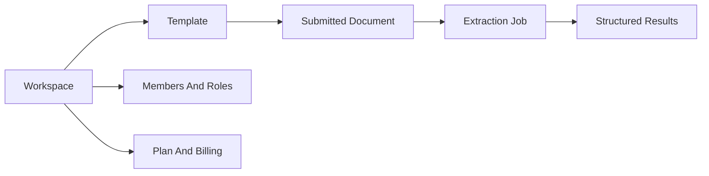

# Document Extraction

Document Extraction is a workspace-based app for turning PDFs and image documents into structured data. Users sign in, choose a Workspace, define reusable Templates, submit Documents, and review asynchronous Extraction jobs.

The app has two surfaces:

- The browser app for day-to-day Workspace, Template, Document, member, and billing workflows.
- A customer API for teams that want to submit Documents and read results from their own systems.

## What You Can Do

- Create Workspaces and invite members.
- Generate Workspace API keys for external API clients.
- Define Templates with typed fields and table-shaped object fields.
- Submit PNG, JPEG, WebP, and PDF Documents for extraction.
- Track Extraction job status and review completed results.
- View Workspace owner billing, Credits, usage, invoices, and subscription actions.

## How It Fits Together

Templates describe the information you want. Documents are the Source files you submit. Extraction jobs track processing and return structured results.

## Quick Links

- Start with [Start Using The App](getting-started/index.md).
- Walk through [First Extraction](getting-started/first-extraction.md).
- Learn the product flow in [Document Extraction](usage/document-extraction.md).
- Compare Workspace plan behavior in [Plans](usage/plans.md).
- Integrate with the customer API through [API Keys](api/authentication.md), [Templates](api/templates.md), and [Extraction Jobs](api/extraction-jobs.md).
- Check plan constraints in [Plans And Limits](reference/plans-and-limits.md).
