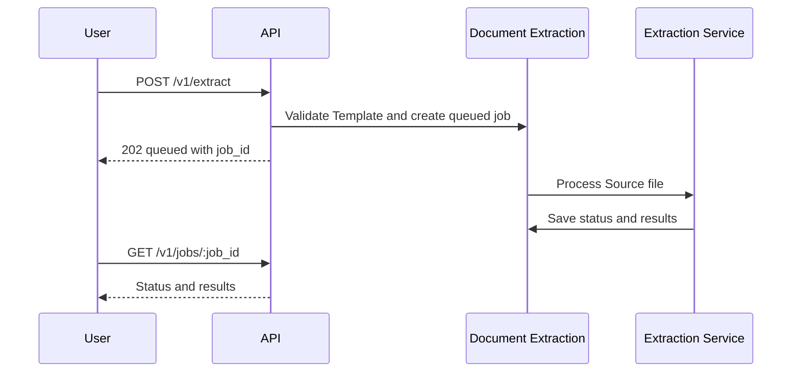

# Document Extraction

Document extraction is asynchronous. A client creates or selects a Template, submits a Document, receives a queued job ID, then reads job status and results.

## Supported Document Types

The upload endpoint accepts:

- `image/png`
- `image/jpeg`
- `image/webp`
- `application/pdf`

PDF page count is used for billing. Images count as one billable Document page.

## Extraction Flow



## Submit A Document

Use `multipart/form-data` with:

| Field | Required | Description |
| --- | --- | --- |
| `template_id` | Yes | Template ID to use for extraction. |
| `document` | Yes | Source file. Must be a supported MIME type. |
| `options` | No | JSON string with result display options. |

Supported `options` keys:

```json
{
  "include_confidence": true,
  "include_evidence": true
}
```

Inline fields are not accepted. Create or update a Template first, then submit Documents with `template_id`.

## Job Statuses

| Status | Meaning |
| --- | --- |
| `queued` | Accepted and waiting for processing. |
| `processing` | Processing has started. |
| `completed` | Results are available. |
| `failed` | The job could not be completed. See `error_code` and `error_message`. |

## Results

Completed jobs return one result per Template field. Each result includes:

- `field_id`
- `name`
- `data_type`
- `status`
- `answer`
- `confidence`
- `evidence`

Result status values are `ok`, `not_found`, `invalid_type`, `unreadable`, and `error`.

## Status Updates In The App

The app updates queued and processing Documents automatically while you work. External API clients should poll job detail with `GET /v1/jobs/{job_id}`.
